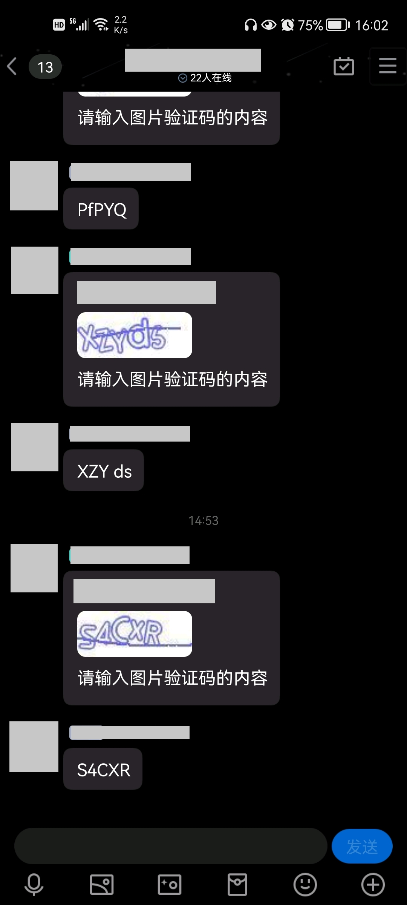

# Mirai Authenticator

> 基于 Mirai Console 的 加群/好友 验证插件 

[](https://github.com/cssxsh/mirai-authenticator/releases)
[](https://repo1.maven.org/maven2/xyz/cssxsh/mirai/mirai-authenticator/)
[](https://search.maven.org/artifact/xyz.cssxsh.mirai/mirai-authenticator)
[](https://github.com/cssxsh/mirai-authenticator/actions/workflows/test.yml)

**使用前应该查阅的相关文档或项目**

*   [User Manual](https://github.com/mamoe/mirai/blob/dev/docs/UserManual.md)
*   [Permission Command](https://github.com/mamoe/mirai/blob/dev/mirai-console/docs/BuiltInCommands.md#permissioncommand)
*   [Chat Command](https://github.com/project-mirai/chat-command)

**目前只实现了加群验证的功能**

## MCL 指令安装

**请确认 mcl.jar 的版本是 2.1.0+**  
`./mcl --update-package xyz.cssxsh.mirai:mirai-authenticator --channel maven-stable --type plugin`

## 指令

### auth-join

配置验证条件, 目前 check 中 可选的 type 有 `profile`, `question`, `bilibili`  
配置验证条件, 目前 validator 中 可选的 type 有 `captcha`

*   `/auth-join check [group] {types}` 进群前检查  
    例如: `/auth-join check 123456 profile question`

*   `/auth-join validator [group] {types}` 进群后验证  
    例如: `/auth-join validator 123456 captcha`

*   `/auth-join official [id]` 设置自动放行的QQ号  
    例如: `/auth-join official 123456789`

*   `/auth-join timeout [mills]` 问题回答等待时间  
    例如: `/auth-join mills 180000`

*   `/auth-join count [value]` 问题允许回答次数  
    例如: `/auth-join count 5`

*   `/auth-join tip [message]` 验证码的提示  
    例如: `/auth-join tip 请输入图片验证码的内容(不区分大小写)`

*   `/auth-join place [group]` 加群请求失败交由管理员处理  
    例如: `/auth-join place 123456`

### auth-captcha

测试验证码功能

*   `/auth-captcha` 会发送一张验证码并接受回答，以供测试  

### auth-check

测试验证码功能

*   `/auth-check question [group] [question] [answer]` 测试群的 question 验证脚本  
    `group` 是群号, `question` 是问题, `answer` 是答案  
    例如: `/auth-check question 123456 天王盖地虎 宝塔镇河妖`  

*   `/auth-check profile [group] [target]` 测试群的 profile 验证脚本  
    `group` 是群号, `target` 是被测试的qq号  
    例如: `/auth-check profile 123456 789566`

*   `/auth-check bilibili [group] [uid]` 测试群的 bilibili 验证脚本  
    `group` 是群号, `uid` 是入群提交的 uid  
    例如: `/auth-check bilibili 123456 789566`

#### 效果

进群后验证:  


## 配置 Lua 校验脚本

自定义验证分别在以下文件夹中
*   `data/xyz.cssxsh.mirai.plugin.mirai-authenticator/profile`  
*   `data/xyz.cssxsh.mirai.plugin.mirai-authenticator/question`
*   `data/xyz.cssxsh.mirai.plugin.mirai-authenticator/bilibili`

脚本文件名对应群号, 例如 `123456.lua`

`Global variable` (bindings) 支持的属性和方法有以下

*   `bot` bot 对象
*   `eventId` 事件id
*   `groupId` 群ID
*   `groupName` 群名
*   `message` 请求消息
*   `invitorId` 邀请人
*   `fromId` 请求者ID
*   `fromNick` 请求者NICK

### Profile 校验脚本

`Profile` 校验脚本主要用于校验用户的 `Profile` 信息  
所以对于 `Profile` 校验脚本, 将支持

*   `fromProfile` 请求者profile
    *   `getAge` 获取年龄
    *   `getQLevel` 获取QQ等级
    *   `getEmail` 获取右键
    *   `getNickname` 获取昵称

例如，检查申请入群者的QQ等级是否大于4:  
```lua
return fromProfile:getQLevel() > 4;
```

### Question 校验脚本

`Question` 校验脚本主要用于校验用户提交的加群问题答案  
所以对于 `Question` 校验脚本, 将支持

*   `question` 问题
*   `answer` 回答

例如，检查答案是否满足要求:
```lua
return answer == "114514" or answer == "......";
```

### BiliBili 校验脚本

`BiliBili` 校验脚本主要用于校验用户提交的 `UID` 当前配置的粉丝牌详情      
对于 `BiliBili` 校验脚本, 将支持

*   `medal` 粉丝牌详情
    *   `getTargetId` 获取主播UID
    *   `getScore` 获取积分
    *   `getLevel` 获取等级
    *   `getGuardLevel` 获取舰长类型 (0 是非舰长)

例如, 检查是否佩戴了 [哔哩哔哩音悦台#11153765](https://space.bilibili.com/11153765) 的粉丝牌，且为舰长 (等级大等于20) :
```lua
return medal:getTargetId() == 11153765 and medal:getLevel() >= 20;
```

## [爱发电](https://afdian.net/@cssxsh)


